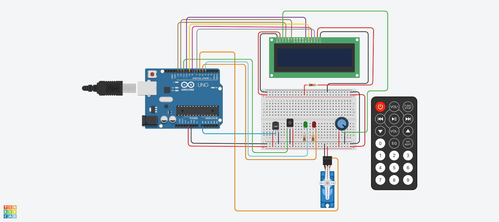

# Segundo-Parcial-SPD
## Autor: Urriche Martin

Consigna: 
El objetivo de este proyecto es diseñar un sistema de incendio utilizando Arduino que pueda
detectar cambios de temperatura y activar un servo motor en caso de detectar un incendio.
Además, se mostrará la temperatura actual y la estación del año en un display LCD.
segmentos.

## 1)Componentes necesarios:

    •Arduino UNO
    •Sensor de temperatura
    •Control remoto IR (Infrarrojo)
    •Display LCD (16x2 caracteres)
    •Servo motor
    •Cables y resistencias según sea necesario
    •Protoboard para realizar las conexiones
    •Dos leds.

## 2)Funcionalidad requerida:

    Conexiones:

        • Conecta el sensor de temperatura al pin analógico A0 de Arduino.
        • Conecta el control remoto IR al pin digital 11 de Arduino.
        • Conecta el display LCD utilizando los pines correspondientes de Arduino.
        • Conecta el servo motor a uno de los pines PWM de Arduino 

     Control remoto:

        • Configura el control remoto IR para recibir señales.
        • Define los comandos necesarios para activar y desactivar el sistema de incendio.
        • Utiliza un algoritmo para determinar la estación del año (por ejemplo, rangos de temperatura para cada estación).

    Detección de temperatura:
        • Configura el sensor de temperatura y realiza la lectura de la temperatura ambiente.
        • Muestra la temperatura actual en el display LCD.

    Sistema de alarma:
        • Define un umbral de temperatura a partir del cual se considera que hay un incendio (por ejemplo, temperatura superior a 60 grados Celsius).
        • Cuando se detecta un incendio (temperatura por encima del umbral), se activa el servo motor para simular una respuesta del sistema de incendio.

    Mensajes en el display LCD:
        • Muestra la temperatura actual y la estación del año en el display LCD.
        • Cuando se detecta un incendio, muestra un mensaje de alarma en el display LCD.

    Punto libre:
        • Se deberá agregar dos leds y darle una funcionalidad de su elección, acorde al proyecto previamente detallado.

## Arduino:

## Codigo:

~~~ C++ 
// C++ code
//
//Bibliotecas
#include <LiquidCrystal.h>
#include <Servo.h>
#include <IRremote.h>

//Definicion de dispositivos
#define Sensor_t A0                
#define led_v 4              
#define led_r 5                     
#define ir_reciver 11

//Servo
Servo myservo;

//Variables
LiquidCrystal lcd (13,12,10,9,8,7);
long int temperatura_c;
String estacion = " ";
String estacionActual= "";
const float temperatura_alerta = 60.0;  

void setup() {
  lcd.begin(16, 2);

  
  myservo.attach(6);
  
  pinMode(led_v, OUTPUT);
  pinMode(led_r, OUTPUT);
  
  IrReceiver.begin(ir_reciver, DISABLE_LED_FEEDBACK);
  
  Serial.begin(9600); 
}

void loop() 
{
  IrReceiver.decode(); 
  switch(IrReceiver.decodedIRData.decodedRawData)
  {
    case 4278238976:
      int lectura = analogRead(Sensor_t);  
      temperatura_c = map(((lectura - 20) * 3.04), 0, 1023, -40, 125);

      // Mostrar la temperatura en el display LCD
      lcd.print("Temp:");
      lcd.setCursor(6, 0);
      lcd.print(temperatura_c);
      lcd.print(" C");
      lcd.setCursor(0,1);
      verificarEstacion(temperatura_c); 
      lcd.print("Estac:"+ String (estacionActual));

      // Verificar si se detecta un incendio 
      if (temperatura_c > temperatura_alerta) 
      {
        activarSistemaIncendio();  
        mostrarMensajeAlarma();  
        encenderLEDs();  
      } 
      else 
      {
        apagarLEDs(); 
        myservo.write(0);
      }

      delay(1000);
      lcd.clear();
  }
}

void activarSistemaIncendio() 
{
  myservo.write(90);  
}

void mostrarMensajeAlarma() 
{
  lcd.clear();  // Limpiar el display LCD
  lcd.setCursor(0,0);
  lcd.print("ALERTA DE ");
  lcd.setCursor(0,1);
  lcd.print("INCENDIO");
  delay(1000);
  lcd.clear();
}

void encenderLEDs() 
{
  digitalWrite(led_v, LOW); 
  delay(500);
  digitalWrite(led_r, HIGH);
  delay(500);
  digitalWrite(led_v, HIGH);
  delay(500);
  digitalWrite(led_r, LOW);

}

void apagarLEDs()
{
  digitalWrite(led_v, HIGH);  
  digitalWrite(led_r, LOW);  
}

void verificarEstacion(float temperatura) 
{
  if (temperatura >= 30) 
  {
    estacionActual = "VERANO";
  } 
  else if (temperatura >= 20 && temperatura < 30) 
  {
    estacionActual = "PRIMAVERA";
  } 
  else if (temperatura >= 10 && temperatura < 20) 
  {
    estacionActual = "OTOÑO";
  } 
  else 
  {
    estacionActual = "INVIERNO";
  }
}

